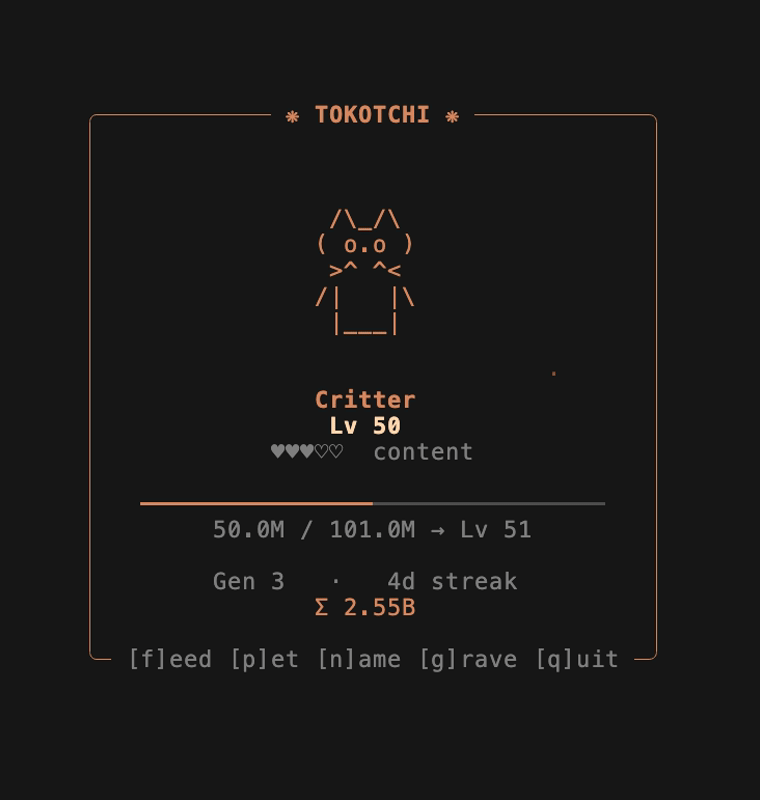

# tokotchi 🥚→👑

A collectible terminal pet that grows off the tokens you spend on [Claude Code](https://claude.com/claude-code). It levels and evolves as you use Claude, you can **feed / pet / name** it, and — if you vanish for too long — it can **die**, leaving a new egg (and a graveyard of past pets) behind.

A single, dependency-free binary: no Python, no `curses`, no `jq`. It scans your Claude Code transcripts itself and keeps its own token tally.



## Install

**Prebuilt binary (recommended)** — grab the archive for your OS from the [latest release](https://github.com/rynzuki/tokotchi/releases/latest), unpack it, and put `tokotchi` on your `PATH`:

```sh
# macOS / Linux — example:
mkdir -p ~/.local/bin
tar -xzf tokotchi-<target>.tar.gz -C ~/.local/bin tokotchi
# ensure ~/.local/bin is on your PATH, then:
tokotchi
```

On **Windows**, unzip and drop `tokotchi.exe` somewhere on your `PATH`.

**From source** (needs a Rust toolchain):

```sh
cargo install --git https://github.com/rynzuki/tokotchi --locked
```

Releases are built for macOS (Apple Silicon + Intel), Linux (x86-64 + arm64), and Windows (x86-64).

## Run

It's a full-screen TUI, so run it in a **separate terminal window/tab** (it can't share the terminal Claude Code is running in):

```sh
tokotchi
```

| key | action |
|---|---|
| `f` | feed — tops up happiness and buys some life |
| `p` | pet — a quick happiness boost |
| `n` | name your pet |
| `g` | browse the graveyard (past pets) |
| `q` | quit |

It re-scans your tokens every 20 s (and once on launch), so there's nothing you *have* to do.

## Leveling & evolution

Each pet's level is a function of the tokens spent **during its own lifetime** (`birth_sigma` snapshots the all-time total when it hatches):

```
level = ⌊ √( (Σ_now − Σ_at_birth) / 1,000,000 ) ⌋
```

Evolution is gated by level:

| Stage | Levels | ~Tokens this life |
|---|---|---|
| 🥚 Egg | 1–4 | 0 |
| 👾 Blob | 5–14 | ~25M |
| 🌱 Sprout | 15–29 | ~225M |
| 🐱 Critter | 30–59 | ~900M |
| 🐉 Beast | 60–99 | ~3.6B |
| 👑 Elder | 100+ | ~10B |

Each stage has its own art, colour, and ambient sparkle flavor, and warms toward full Claude-clay as it grows.

## Care, mood & mortality

Hybrid, and deliberately low-stress:

- **Vitality** (survival) tracks *token activity* — full whenever you've used Claude recently. It only decays after a **~3-day** grace with no new tokens, and the pet dies only after a **~10-day** drought. Feeding adds a buffer (up to a few days) so you can bridge a break.
- **Happiness** (bond) decays over days and is restored by `feed`/`pet`. Low happiness makes the pet **grumpy** (a sad face + a gentle statusline nudge) — but never kills it.
- **Death → new generation.** When vitality hits zero the pet passes away, is recorded in the **graveyard** (name, stage, generation, lifespan), and a fresh Egg hatches whose level counts only tokens from that moment on. Your all-time Σ persists as a lifetime stat.

## Statusline integration

`tokotchi level` prints one tab-separated line for a statusline to consume:

```
<level>\t<stage>\t<emoji>\t<levelup>\t<mood>\t<hearts 0-5>\t<streak>\t<generation>
```

Fields 1–4 are stable; 5–8 are the care layer. `levelup` flags a level-up for ~45 s after it happens (tracked in `~/.claude/.tokotchi_state.json`). Example shell snippet (see the statusline that ships in the author's dotfiles):

```sh
tok=$(tokotchi level 2>/dev/null)
lvl=$(printf '%s' "$tok" | cut -f1); name=$(printf '%s' "$tok" | cut -f2)
printf 'Lv %s (%s)' "$lvl" "$name"
```

The statusline snippet is a shell one-liner (macOS/Linux/WSL). The `tokotchi` binary itself is cross-platform.

## Your data

Two files under `~/.claude/` (`%USERPROFILE%\.claude` on Windows), independent of where the binary is installed — so they **survive reinstalling/upgrading tokotchi**:

- `.token_ledger.json` — per-session token tally (prune-proof; survives transcript pruning).
- `.tokotchi_state.json` — your pet: generation, name, happiness, streak, graveyard. Schema changes are migrated, never wiped.

## Art & animation

Creature art lives in `art/<stage>/<clip>.txt`, embedded into the binary at build time. A clip is one or more frames separated by a `---` line, with an optional options header:

```
# fps=3 loop=pingpong
<frame 1 lines>
---
<frame 2 lines>
```

Clips: `idle` (required), `blink`, `sad`, `happy`, `celebrate`. To add an animation, drop a file; to add an **evolution**, add a folder + one `Stage` entry in `src/model.rs`. A test suite validates that art fits the fixed card and every glyph is single-width so nothing ever reflows.

## Development

`./dev.sh` runs a live-reloading loop — edit any `src/*.rs` **or** art file and the running TUI cleanly relaunches with your change.

## License

MIT © Yannic Oberhausen
